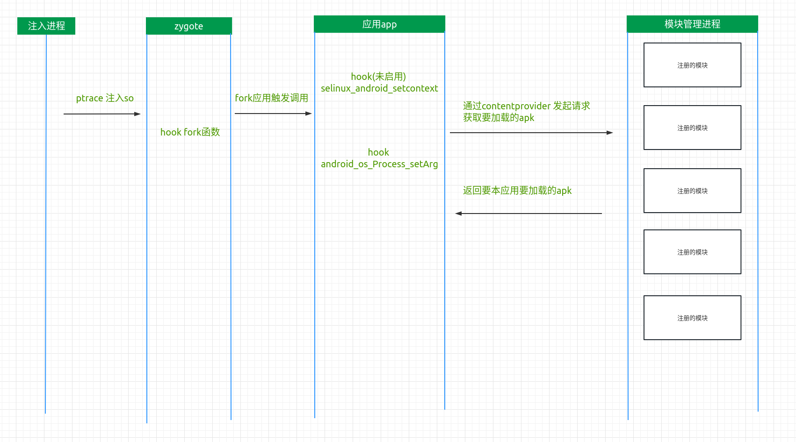

## android安全---从零打造一款全局注入工具rxposed

## 这篇博客的目的是什么
在android平台上实现一个全局注入框架，在每个应用启动的时候，都可以先进行hook。以及这个工具的一些辅助逆向和测试方式

## 为什么要写这个工具

通过ptrace进行注入和hook，这个想法我估计很多人都会有，但是目前除了frida。
把一些技术梳理一下，然后合并起来做成一个成品，这是一件比较有成就的事情。
同时将各个部分所需要的技术都深入的研究一下，做成一个无感知的工具，来对抗不厌其烦的特征检测。

### 为什么不用frida：
frida无疑大大的降低了逆向的门槛和难度，但是，正因为如此也导致了frida特征众多，对于真正想要检测他的技术，几乎无法绕过。

### 为什么不用lsposed
lsposed注入依赖于magisk的zygisk,太重了，而且使用xposed已经被检测烂了，另外lsposed好像有两个问题
1、启动时机的问题，不知道是否是修复了，还是因为我曾经测试的保活app用了技巧。但是我记得，应用最初加载执行时机比lsposed时机更早
2、自己加载自己，你在你应用里写个xposed模块的入口，他会自己加载，这估计是个bug


## 使用的开源项目

注入采用ptrace的方法
全局注入的方式是注入到zygote进程中，在应用启动的时候，会从zygote进程进行fork，然后hook住相应的应用入口函数
hook的入口函数，参考了frida的代码
native hook 使用的是dobby(好像在某些手机还存在一些问题)
java hook 使用了sandhook


项目流程

核心代码只有一个so，只需要注入zygote，调用入口函数即可。因为提供可外部模块加载选项功能，需要一个管理程序，通过contentprovider和注入的so进行通讯。管理程序的contentprovider uri需要传给入口函数当参数

在应用启动的时候，so代码会与管理程序的contentprovider通讯，询问要加载那些插件，会加载这些apk，调用入口，并把context 传入给要加载的插件作为参数


## 正文

### 全局hook注入到app应用中


#### 操作示意图



#### ptrace方式注入so库到zygote进程中
android 发展至今，好像三款工具做到了xposed、magisk、frida。别的可能太小众，可能我忘记了。
magisk 和xposed 可以说都是通过系统文件替换的方式 ，xposed输入替换了java方法执行的so库，magisk属于从系统启动开始接管了系统的权限
frida 是通过root权限ptrace zygote进程，进行注入。
而我们想要做的是小巧，简单，可定制修改，减少依赖、特征，所以采用了ptrace的方式 。


#### hook 的接口
这三个接口都是在frida里找到的，不敢居功，我也试过一些别的，各种问题，最后抄过来了。
+ fork
fork作为一个新进程的第一入口，应用进程是从zygote进程fork的，所以，在这里hook，能确保第一时间进行应用入口拦截。
+ 注：vfork 函数，这个函数我也试过，但是发现不能hook，目前没有深入分析原因，但是我发现frida也存在这个问题，可能触发了什么。

+ selinux_android_setcontext(可选，目前未使用)
这个函数，是应用在启动的时候设置安全上下文，通俗一点说就是权限。这个位置是在fork新进程以后hook，也就是在app应用进程里hook
+ 注：这个位置如果做修改估计可以修改应用权限。


+ android_os_Process_setArg

  这个位置属于抄过来的，还不错。

  我在使用的时候发现，这个函数很多位置都会调用。而我们想要使用的位置：

  ```
      @UnsupportedAppUsage
      private void handleBindApplication(AppBindData data) {
          // Register the UI Thread as a sensitive thread to the runtime.
          VMRuntime.registerSensitiveThread();
          // In the case the stack depth property exists, pass it down to the runtime.
          String property = SystemProperties.get("debug.allocTracker.stackDepth");
          if (property.length() != 0) {
              VMDebug.setAllocTrackerStackDepth(Integer.parseInt(property));
          }
          if (data.trackAllocation) {
              DdmVmInternal.enableRecentAllocations(true);
          }
  
          // Note when this process has started.
          Process.setStartTimes(SystemClock.elapsedRealtime(), SystemClock.uptimeMillis());
  
          mBoundApplication = data;
          mConfiguration = new Configuration(data.config);
          mCompatConfiguration = new Configuration(data.config);
  
          mProfiler = new Profiler();
          String agent = null;
          if (data.initProfilerInfo != null) {
              mProfiler.profileFile = data.initProfilerInfo.profileFile;
              mProfiler.profileFd = data.initProfilerInfo.profileFd;
              mProfiler.samplingInterval = data.initProfilerInfo.samplingInterval;
              mProfiler.autoStopProfiler = data.initProfilerInfo.autoStopProfiler;
              mProfiler.streamingOutput = data.initProfilerInfo.streamingOutput;
              if (data.initProfilerInfo.attachAgentDuringBind) {
                  agent = data.initProfilerInfo.agent;
              }
          }
  
          // send up app name; do this *before* waiting for debugger  //在这里
          Process.setArgV0(data.processName);
          
  ```

​		进过几次测试，我发现这个函数，应该是第三次调用的时候，开服务什么的，好像也会调用。而上面代码执行的时候，ActivityThread 这个类的main函数已经执行过了，并且sCurrentActivityThread 已经初始化过了，所以我们判断sCurrentActivityThread的值，如果他为null，我们就等待下一次调用，知道有值为止。

​		另外还有一个问题就是isolatedProcess。对于这种类型的进程，目前并未进行兼容，直接跳过了，但是还是很好判断的

```
bool rprocess::is_isIsolatedProcess() {
    int uid = getuid();
    return (uid >= 99000 && uid <= 99999)|| (uid >= 90000 && uid <= 98999);
}
```


#### 通过ContentProvider 和管理app通讯
+ 通讯方式的选择
  
    inux有很多种进程通讯方式，但是他们都是“进程”通讯，不是应用通讯。一个应用包括进程，但是一个进程，却不能说成一个应用。而linux 所以的通讯都是建立在进程基础上，也就是活着的应用，如果应用死了那，这是无法做到的。所以我就想到了，使用andriod的应用通讯，应用死了，也能拉起来。当然了，更重要的是，兼容性好，简单，不用考虑进程死了如何拉起这些问题。
    
+ 为什么用ContentProvider
  
    我们是一个后台程序，要拉起应用，然后通讯，并且接受返回结果。有两种方式ContentProvider 和 android service + binder 的aidl。
    
    但是在使用中我发现android binder提供的aidl的回调时机不可控，是异步。ContentProvider却可以阻塞等待返回结果，是同步。所以选择了ContentProvider


#### android 应用的context

我们想要使用ContentProvider 必须要获取一个context,一般来说我们写app的时候，是可以直接拿来使用的


context到底是什么
```java
很多逆向项目中都这样使用
Application mApplication = Class.forName(“android.app.ActivityThread”).getMethod(“currentApplication”).invoke(null,(Object[])null);
返回的这个mApplication 就可以当做context使用


class ActivityThread

  @UnsupportedAppUsage
    public static Application currentApplication() {
        ActivityThread am = currentActivityThread();
        return am != null ? am.mInitialApplication : null;
    }

   @UnsupportedAppUsage
    public static ActivityThread currentActivityThread() {
        return sCurrentActivityThread;
    }

    @UnsupportedAppUsage
    public Application getApplication() {
        return mInitialApplication;
    }

获取的是mInitialApplication
  
```
首先我们先通过堆栈打印的方法打印一下android Application 的启动的堆栈

static静态代码块堆栈   ActivityThread.java:handleBindApplication(6431)
```
hepta.lianxin.sdkprivacydog.PrivacyApp.PrivacyApp.java:<clinit>(38)
java.lang.Class.Class.java:newInstance(-2)
android.app.AppComponentFactory.AppComponentFactory.java:instantiateApplication(76)
androidx.core.app.CoreComponentFactory.CoreComponentFactory.java:instantiateApplication(52)
android.app.Instrumentation.Instrumentation.java:newApplication(1155)
android.app.LoadedApk.LoadedApk.java:makeApplication(1218)
android.app.ActivityThread.ActivityThread.java:handleBindApplication(6431)
android.app.ActivityThread.ActivityThread.java:access$1300(219)
android.app.ActivityThread$H.ActivityThread.java:handleMessage(1859)
android.os.Handler.Handler.java:dispatchMessage(107)
android.os.Looper.Looper.java:loop(214)
android.app.ActivityThread.ActivityThread.java:main(7356)
java.lang.reflect.Method.Method.java:invoke(-2)
com.android.internal.os.RuntimeInit$MethodAndArgsCaller.RuntimeInit.java:run(492)
com.android.internal.os.ZygoteInit.ZygoteInit.java:main(930)
```


Application attachBaseContext 函数堆栈 ActivityThread.java:handleBindApplication(6431)
```
hepta.lianxin.sdkprivacydog.PrivacyApp.PrivacyApp.java:getCallStatck(45)
hepta.lianxin.sdkprivacydog.PrivacyApp.PrivacyApp.java:attachBaseContext(22)
android.app.Application.Application.java:attach(351)
android.app.Instrumentation.Instrumentation.java:newApplication(1156)
android.app.LoadedApk.LoadedApk.java:makeApplication(1218)
android.app.ActivityThread.ActivityThread.java:handleBindApplication(6431)
android.app.ActivityThread.ActivityThread.java:access$1300(219)
android.app.ActivityThread$H.ActivityThread.java:handleMessage(1859)
android.os.Handler.Handler.java:dispatchMessage(107)
android.os.Looper.Looper.java:loop(214)
android.app.ActivityThread.ActivityThread.java:main(7356)
java.lang.reflect.Method.Method.java:invoke(-2)
com.android.internal.os.RuntimeInit$MethodAndArgsCaller.RuntimeInit.java:run(492)
com.android.internal.os.ZygoteInit.ZygoteInit.java:main(930)
```


Application oncreate函数堆栈  ActivityThread.java:handleBindApplication(6460)
```
hepta.lianxin.sdkprivacydog.PrivacyApp.PrivacyApp.java:onCreate(28)
android.app.Instrumentation.Instrumentation.java:callApplicationOnCreate(1189)
android.app.ActivityThread.ActivityThread.java:handleBindApplication(6460)
android.app.ActivityThread.ActivityThread.java:access$1300(219)
android.app.ActivityThread$H.ActivityThread.java:handleMessage(1859)
android.os.Handler.Handler.java:dispatchMessage(107)
android.os.Looper.Looper.java:loop(214)
android.app.ActivityThread.ActivityThread.java:main(7356)
java.lang.reflect.Method.Method.java:invoke(-2)
com.android.internal.os.RuntimeInit$MethodAndArgsCaller.RuntimeInit.java:run(492)
com.android.internal.os.ZygoteInit.ZygoteInit.java:main(930)
```


我们来看一下我们hook的位置android_os_Process_setArg和mInitialApplication初始化 在应用启动函数handleBindApplication的位置
``` 
    private void handleBindApplication(AppBindData data) {
        // Register the UI Thread as a sensitive thread to the runtime.
        VMRuntime.registerSensitiveThread();
        // In the case the stack depth property exists, pass it down to the runtime.
        String property = SystemProperties.get("debug.allocTracker.stackDepth");
        if (property.length() != 0) {
            VMDebug.setAllocTrackerStackDepth(Integer.parseInt(property));
        }
        if (data.trackAllocation) {
            DdmVmInternal.enableRecentAllocations(true);
        }

        // Note when this process has started.
        Process.setStartTimes(SystemClock.elapsedRealtime(), SystemClock.uptimeMillis());

        mBoundApplication = data;
        mConfiguration = new Configuration(data.config);
        mCompatConfiguration = new Configuration(data.config);

        mProfiler = new Profiler();
        String agent = null;
        if (data.initProfilerInfo != null) {
            mProfiler.profileFile = data.initProfilerInfo.profileFile;
            mProfiler.profileFd = data.initProfilerInfo.profileFd;
            mProfiler.samplingInterval = data.initProfilerInfo.samplingInterval;
            mProfiler.autoStopProfiler = data.initProfilerInfo.autoStopProfiler;
            mProfiler.streamingOutput = data.initProfilerInfo.streamingOutput;
            if (data.initProfilerInfo.attachAgentDuringBind) {
                agent = data.initProfilerInfo.agent;
            }
        }

        // send up app name; do this *before* waiting for debugger
        Process.setArgV0(data.processName);       							// 6155行 在这个位置hook android_os_Process_setArg
        android.ddm.DdmHandleAppName.setAppName(data.processName,
                                                UserHandle.myUserId());
        VMRuntime.setProcessPackageName(data.appInfo.packageName);

        // Pass data directory path to ART. This is used for caching information and
        // should be set before any application code is loaded.
        VMRuntime.setProcessDataDirectory(data.appInfo.dataDir);

        if (mProfiler.profileFd != null) {
            mProfiler.startProfiling();
        }
      .......
      .......
      .......
      try {
            // If the app is being launched for full backup or restore, bring it up in
            // a restricted environment with the base application class.
            app = data.info.makeApplication(data.restrictedBackupMode, null);  // 6431行  在这个调用 static 代码块和attachBaseContext，也是在这里生成了  mInitialApplication 被赋值的对象 app

            // Propagate autofill compat state
            app.setAutofillOptions(data.autofillOptions);

            // Propagate Content Capture options
            app.setContentCaptureOptions(data.contentCaptureOptions);

            mInitialApplication = app;      									// 6439行  mInitialApplication 在这个位置赋值   

            // don't bring up providers in restricted mode; they may depend on the
            // app's custom Application class
            if (!data.restrictedBackupMode) {
                if (!ArrayUtils.isEmpty(data.providers)) {
                    installContentProviders(app, data.providers);
                }
            }

            // Do this after providers, since instrumentation tests generally start their
            // test thread at this point, and we don't want that racing.
            try {
                mInstrumentation.onCreate(data.instrumentationArgs);
            }
            catch (Exception e) {
                throw new RuntimeException(
                    "Exception thrown in onCreate() of "
                    + data.instrumentationName + ": " + e.toString(), e);
            }
            try {
                mInstrumentation.callApplicationOnCreate(app);              		// 6460行  在这里调用了onCreate函数
            } catch (Exception e) {
                if (!mInstrumentation.onException(app, e)) {
                    throw new RuntimeException(
                      "Unable to create application " + app.getClass().getName()
                      + ": " + e.toString(), e);
                }
            }
        } finally {
            // If the app targets < O-MR1, or doesn't change the thread policy
            // during startup, clobber the policy to maintain behavior of b/36951662
            if (data.appInfo.targetSdkVersion < Build.VERSION_CODES.O_MR1
                    || StrictMode.getThreadPolicy().equals(writesAllowedPolicy)) {
                StrictMode.setThreadPolicy(savedPolicy);
            }
        }


```
从上面的代码可以看出我们hook的位置，离Context 构建和初始化的位置很远，不可能正常按照代码流程执行的方式拿到Context。


ContentPrivider 和context
我们要发起ContentPrivider 请求，必须需要一个context。
```java
ContentResolver contentResolver = getApplication().getContentResolver();
```
但是我们获取不到context怎么办。
第一种方法：（android9 可用，android10 失效）
直接获取SystemContext。(关于Application context 和 System context 我就不细讲了，想要深入了解的看下代码和资料吧，比较简单)

ActivityThread 有一个静态方法
```
   public ContextImpl getSystemContext() {
        synchronized (this) {
            if (mSystemContext == null) {
                mSystemContext = ContextImpl.createSystemContext(this);
            }
            return mSystemContext;
        }
    }

```
我们可以这样使用
```
    private static Context getSystemContext() {
        Context context = null;
        try {
            Method method = Class.forName("android.app.ActivityThread").getMethod("currentActivityThread");
            method.setAccessible(true);
            Object activityThread = method.invoke(null);
            context = (Context) activityThread.getClass().getMethod("getSystemContext").invoke(activityThread);

        } catch (final Exception e) {
            e.printStackTrace();
            Log.e(TAG, "getSystemContext:"+e.toString());
        }
        return context;
    }
```
这样即使mInitialApplication 未初始化，我们在handleBindApplication 函数任意位置，调用这段代码都能获取一个context。但是这个一个System context。
这个context 本来用的挺好的，但是有一天偶然换了个手机，发现直接不能用了。。。。。。。

原因就是因为他是一个System context 而不是一个 Application context,我仔细研究以后发现我原来的时候是android 9，换的手机是android 10 ,也就是说，System context 在9 版本还是能用的，但是到了10 就不行了，因为android 10 以后，android对context做了要求。本应用只能用本应用的context 发起ContentPrivider请求，不能用System的context ，更不能用 别的应用的context的发起请求。（我代码里有如何通过通过appName 生成context,可以自己试试）

注：没做要求之前，我估计应用可以通过伪装context发起ContentPrivider请求， ContentPrivider有个来源验证，根本没有办法判断是谁发来的，造成漏洞。


第二种方法（android 10 进行了测试，android9 和一些别的版本估计也行）：

这个困扰了我很久，当时我几乎放弃了，中途我也试过hook别的位置，找别的点位，整了很久，就是不死心，总想试试，然后研究和很长时间代码，突然想，我是否将他生成context的代码先执行一遍，拿到context再说，经过分析测试，然后我就实现了这个功能。


```
  //这里用的getSystemContext 函数，就是第一种方法中使用的 
    public static Context Java_getApplicationContext(String currentAppName) {
        //获取 ActivityThread 类
        Class<?> mActivityThreadClass = null;
        try {
            mActivityThreadClass = Class.forName("android.app.ActivityThread");

        //获取 ActivityThread 类
        Class<?> mLoadedApkClass = Class.forName("android.app.LoadedApk");
        //获取 ActivityThread 的 currentActivityThread() 方法
        Method currentActivityThread = mActivityThreadClass.getDeclaredMethod("currentActivityThread");
        currentActivityThread.setAccessible(true);
        //获取 ActivityThread 实例
        Object mActivityThread = currentActivityThread.invoke(null);

        Class<?> mCompatibilityInfoClass = Class.forName("android.content.res.CompatibilityInfo");
        Method getLoadedApkMethod = mActivityThreadClass.getDeclaredMethod("getPackageInfoNoCheck",
                ApplicationInfo.class, mCompatibilityInfoClass);

        /*
             public static final CompatibilityInfo DEFAULT_COMPATIBILITY_INFO = new CompatibilityInfo() {};
         */
        //以上注释是获取默认的 CompatibilityInfo 实例
        Field mCompatibilityInfoDefaultField = mCompatibilityInfoClass.getDeclaredField("DEFAULT_COMPATIBILITY_INFO");
        Object mCompatibilityInfo = mCompatibilityInfoDefaultField.get(null);

        //获取一个 ApplicationInfo实例
        ApplicationInfo applicationInfo = getSystemContext().getPackageManager().getApplicationInfo(currentAppName,0);
        //执行此方法，获取一个 LoadedApk
        Object mLoadedApk = getLoadedApkMethod.invoke(mActivityThread, applicationInfo, mCompatibilityInfo);
        Class<?> mContextImplClass = Class.forName("android.app.ContextImpl");
        Method createAppContext = mContextImplClass.getDeclaredMethod("createAppContext",mActivityThreadClass,mLoadedApkClass);
        createAppContext.setAccessible(true);
        Object context =  createAppContext.invoke(null,mActivityThread,mLoadedApk);
        return (Context) context;

        } catch (PackageManager.NameNotFoundException e) {
            Log.e(TAG,"getApplicationInfoAsUser NOT FOUND,return getSystemContext");
            return getSystemContext();
        }catch (Exception e){
            e.printStackTrace();
            return null;
        }
    }

```
这一部分我大致说一下，就不细致分析了，我们前面说我们需要mInitialApplication 初始化，但是后来我发现mInitialApplication 是一个Appliaion 类，而我们最终要用的是在Application 里的context，所以我们要找的是Application里的context的生成方法也可以。
就是下面两行

```
    data.info = getPackageInfoNoCheck(data.appInfo, data.compatInfo);     //6215行
    final ContextImpl appContext = ContextImpl.createAppContext(this, data.info);    //6343行
```
我们可以再看一下 app = data.info.makeApplication(data.restrictedBackupMode, null); 的makeApplication 方法的实现
```
public Application makeApplication(boolean forceDefaultAppClass,
            Instrumentation instrumentation) {
        if (mApplication != null) {
            return mApplication;
        }

        Trace.traceBegin(Trace.TRACE_TAG_ACTIVITY_MANAGER, "makeApplication");

        Application app = null;

        String appClass = mApplicationInfo.className;
        if (forceDefaultAppClass || (appClass == null)) {
            appClass = "android.app.Application";
        }

        try {
            java.lang.ClassLoader cl = getClassLoader();
            if (!mPackageName.equals("android")) {
                Trace.traceBegin(Trace.TRACE_TAG_ACTIVITY_MANAGER,
                        "initializeJavaContextClassLoader");
                initializeJavaContextClassLoader();
                Trace.traceEnd(Trace.TRACE_TAG_ACTIVITY_MANAGER);
            }
            ContextImpl appContext = ContextImpl.createAppContext(mActivityThread, this);  //在这里
            app = mActivityThread.mInstrumentation.newApplication(
                    cl, appClass, appContext);
            appContext.setOuterContext(app);
        } catch (Exception e) {
            if (!mActivityThread.mInstrumentation.onException(app, e)) {
                Trace.traceEnd(Trace.TRACE_TAG_ACTIVITY_MANAGER);
                throw new RuntimeException(
                    "Unable to instantiate application " + appClass
                    + ": " + e.toString(), e);
            }
        }
        mActivityThread.mAllApplications.add(app);
        mApplication = app;

        ..............
   

        return app;
    }

```

在android 10 可以直接使用这个context 发动contentprovider请求了


#### 应用注入

前面说了，java hook 我使用的是sandhook,作为进程内hook使用的时候，自然不需要做什么，但是作为注入进程的插件可就不一样了。
我采用的是xposed那样的方式，每个插件都是一个应用，被hook的程序直接将这个apk文件加载进来，如果你想要的仅仅是执行java代码，是没有问题的，但是 使用sandhook还是有坑的。

+ 1、so库路径问题

    我们都知道android的so库路径是 /data/app/包名+乱码/libs 这个是应用安装以后生成的，so库会在这个目录下面。而加载插件的方法使用的是DexClassLoader
    ```
    第一个参数是apk路径
    第三个参数是要加载的这个apk 所安装的应用的lib目录
    
    DexClassLoader XpApkClassLoader = new DexClassLoader(applicationInfo.sourceDir,null,applicationInfo.nativeLibraryDir,mcl);
    
    ```
    应用的lib目录我测试过，或者说所有应用的安装目录，都是可以全局访问，lib也是全局可访问的，我加载apk文件的时候，直接把他so库的路径也上，这个代码我也试过，是完全可以的。这个so库是可以加载到别的应用里的。但是怎么测试，nativeLibraryDir路径也对，还是找不到so库。

    经过排查我发现，/data/app/包名+乱码/libs 这个目录下竟然没有so文件，尬住sandhook 使用需要context 和 classloader。context 我们前面已经获取了，可以直接给他，但是我们好像没有classloader。
    这个问题，开始我在android 9使用了。然后我突然想起来AndroidManifest.xml文件有个参数 android:extractNativeLibs
    
    ```
    android:extractNativeLibs="false" : 运行的时候直接从apk文件中加载so文件
    
    android:extractNativeLibs="true"  : 安装的时候会解压so文件到 /data/app/packageName/lib
    ```

    + 第一种解决方案

    额，也就是说，每个编写的模块，添加上android:extractNativeLibs="true" 即可，高版本的android studio 默认是false。

    + 第二种解决方案
    
    在搞完第一种方案以后，没感觉什么问题，但是用的时候出了问题，我才想起来，android so库安装解压，只解压一种架构，也就是说，第一种方式，不能同时支持32位和64位的so，只能支持一种。所以我决定研究一下从zip文件加载so。


    以前做android ndk开发的时候，c++代码写完了运行的时候，与预期相差甚远，好像就像没改过一样，原来的bug一样发生，当时我以为手机出问题了，换换手机，重启一下。 在解决这个问题的时候我在网上找到了这个资料
    https://android.googlesource.com/platform/bionic/+/master/android-changes-for-ndk-developers.md
    
    它上面就说了这个问题，android 应用在安装的时候，由于某些原因，没有把so文件替换掉，还是使用的原来旧版本的so文件，导致新安装的应用出现了bug，因为这个问题有人还专门写了个项目relink,所以后来google修改了这部分，为了防止so文件在复制出错，直接在加载apk文件的时候，加载apk文件中的so。
    
    在andorid的高版本中，dlopen函数可以直接加载zip文件中的so，不过需要zipalign这个工具的支持
    
    [226] 770C0217 0x0000007b45e4f000 /data/app/com.fenfei.sandhookdemo-ElOUt67V8io2JxCErCjbjA==/base.apk!/lib/arm64-v8a/libsandhook.so (0x0000007b45e4f000)
    
    这个就是直接加载apk文件中的so
    
    所以第二种方案就是用dlopen在apk加载之前，先把so文件加载进来，然后在加载运行dex，这样so文件就可以找到了，好像更不优雅，更麻烦。


+ 2、java hook 以及需要的android java 运行环境

    开始的使用我是用android 9的方法写的，用的是一个systen context,但是这个context，是无法给sandhook使用的，因为sandhook需要一个app context。
    
    另外classloader,如果你hook系统代码，应该使用system的classloader就可以了，但是如果你想要hook用户代码，你就必须使用加载了用户代码的classloader。但是因为你hook入口点很早，用户apk的代码还未加载，你无法拿到用户的代码。
    
    第一种方法：
    
    有个折中方案，就是先hook系统代码，因为用户也会继承系统的类，当这些hook代码触发一下，表示用户代码已经开始执行了，然后我们在这些位置，获取用户代码的classloader。
    
    第二种方法：
    
    在android 10 上，由于找到了context的生成方法,他有一个关键的函数**getPackageInfoNoCheck()** 
    
    
    
    ​				(别人的图)
    
    我们使用getPackageInfoNoCheck 函数，会直接实例化LoadedApk，然后存在mPackages里面，然后我们直接用当前这个context的classloader 就可以获取用户的代码
    
    
    
    测试：
    
    ```
        public static void hook_app_class_text(Context context){
            Log.e("XposedCompat", "entry XposedEntry hook_app_class_text");
    
            XposedCompat.cacheDir = context.getCacheDir();
    //for load xp module(sandvxp)
            XposedCompat.context = context;
            XposedCompat.classLoader = context.getClassLoader();
            XposedCompat.isFirstApplication= true;
    
            XposedHelpers.findAndHookMethod("com.hepta.theptavpn.TheptaVapApp",context.getClassLoader(), "onCreate", new XC_MethodHook() {
    
    //        XposedHelpers.findAndHookMethod(Application.class, "onCreate",new XC_MethodHook() {
                @Override
                protected void beforeHookedMethod(XC_MethodHook.MethodHookParam param) throws Throwable {
                    super.beforeHookedMethod(param);
                    Log.e("XposedCompat", "XposedEntry beforeHookedMethod: " + param.method.getName());
                }
    
                @Override
                protected void afterHookedMethod(MethodHookParam param) throws Throwable {
                    super.afterHookedMethod(param);
                    Log.e("XposedCompat", "XposedEntry afterHookedMethod: " + param.method.getName());
                }
            });
        }
    ```
    
    效果：
    
    ```
    D/SandHook: method <public void com.hepta.theptavpn.TheptaVapApp.onCreate()> hook <replacement> success!
            D/SandXposed: hook method <public void com.hepta.theptavpn.TheptaVapApp.onCreate()> cost 27 ms, by internal stub
            E/TheptaVapApp: androidx.core.app.CoreComponentFactory.CoreComponentFactory.java:instantiateApplication(52)
            android.app.Instrumentation.Instrumentation.java:newApplication(1155)
            android.app.LoadedApk.LoadedApk.java:makeApplication(1218)
            android.app.ActivityThread.ActivityThread.java:handleBindApplication(6431)
            android.app.ActivityThread.ActivityThread.java:access$1300(219)
            android.app.ActivityThread$H.ActivityThread.java:handleMessage(1859)
            android.os.Handler.Handler.java:dispatchMessage(107)
            android.os.Looper.Looper.java:loop(214)
            android.app.ActivityThread.ActivityThread.java:main(7356)
            java.lang.reflect.Method.Method.java:invoke(-2)
            com.android.internal.os.RuntimeInit$MethodAndArgsCaller.RuntimeInit.java:run(492)
            com.android.internal.os.ZygoteInit.ZygoteInit.java:main(930)
            D/SandXposed: method <public void com.hepta.theptavpn.TheptaVapApp.onCreate()> hook in
            E/XposedCompat: XposedEntry beforeHookedMethod: onCreate
            E/TheptaVapApp onCreate: com.swift.sandhook.SandHook.SandHook.java:callOriginMethod(163)
            com.swift.sandhook.xposedcompat.hookstub.HookStubManager.HookStubManager.java:hookBridge(299)
            com.swift.sandhook.xposedcompat.hookstub.MethodHookerStubs64.MethodHookerStubs64.java:stub_hook_0(80)
            android.app.Instrumentation.Instrumentation.java:callApplicationOnCreate(1189)
            android.app.ActivityThread.ActivityThread.java:handleBindApplication(6460)
            android.app.ActivityThread.ActivityThread.java:access$1300(219)
            android.app.ActivityThread$H.ActivityThread.java:handleMessage(1859)
            android.os.Handler.Handler.java:dispatchMessage(107)
            android.os.Looper.Looper.java:loop(214)
            android.app.ActivityThread.ActivityThread.java:main(7356)
            java.lang.reflect.Method.Method.java:invoke(-2)
            com.android.internal.os.RuntimeInit$MethodAndArgsCaller.RuntimeInit.java:run(492)
            com.android.internal.os.ZygoteInit.ZygoteInit.java:main(930)
            E/XposedCompat: XposedEntry afterHookedMethod: onCreate
    ```
    
    

### rxposed框架的使用

+ 使用介绍

我并未使用xposed加载的方式，而是全部放在了manifest 文件中

```
        <meta-data
        <!-- 这是一个rxposed模块 -->
            android:name="rxmodule"
            android:value="true" />
        <meta-data
         <!-- 入口类名 -->
            android:name="rxposed_clsentry"
            android:value="hepta.rxposed.loadxposed.XposedEntry" />

        <meta-data
        <!-- 入口方法名 -->
            android:name="rxposed_mtdentry"
            android:value="hook_app_class_text" />
           
           
           
           
    静态方法 ，参数为context

    public static void hook_app_class_text(Context context){
    
	}
```


+ 兼容xposed

写完了发现很多模块都是xposed,于是就写个demo，兼容一个xposed。

rxposed本身并不提供hook功能，所以hook我使用sandhook来做。剩下的就是解析加载xposed模块。xposed模块，为了让每一个应用都可以选择要加载的模块，所以，我把这个rxposed模块，做成了一个xposed管理器，提供contentprovider ，注入的rxposed 会询问contentprovider，加载那些app。

```
   //rxposed 模块入口函数
   static void Entry(Context context){
        XposedCompat.cacheDir = context.getCacheDir();
        XposedCompat.context = context;
        XposedCompat.classLoader = context.getClassLoader();
        Log.e(TAG, "loadxposed Entry");
        Uri uri = Uri.parse("content://hepta.rxposed.loadxposed.Provider");
        ContentResolver contentResolver = context.getContentResolver();
        Bundle bundle =contentResolver.call(uri,"getConfig",context.getPackageName(),null);
        String enableUidList_str =  bundle.getString("enableUidList");
        if(enableUidList_str.equals("null")){
            Log.w(TAG,"getloadxposedPrvider is null");
            return ;
        }
        String[] app_vec = enableUidList_str.split("\\|");
        for(String app :app_vec){
            try {
                ApplicationInfo applicationInfo =  context.getPackageManager().getApplicationInfo(app,0);
                LoadApk(applicationInfo,context);
            } catch (PackageManager.NameNotFoundException | IOException | ClassNotFoundException e) {
                e.printStackTrace();
            }
        }
        try {
            XposedCompat.callXposedModuleInit();
        } catch (Throwable e) {
            e.printStackTrace();
        }
    }
    //加载rxposed 模块，可能有些资源啥的，别的功能我没做兼容，只能加载IXposedHookLoadPackage
    static Boolean LoadApk(ApplicationInfo applicationInfo, Context context) throws IOException, ClassNotFoundException
    {
        Log.e(TAG, "LoadApk:"+applicationInfo.packageName);
        ZipFile zipFile = null;
        InputStream is;

        zipFile = new ZipFile(applicationInfo.sourceDir);
        ZipEntry zipEntry = zipFile.getEntry("assets/xposed_init");
        if (zipEntry == null) {
            Log.e(TAG, "  assets/xposed_init not found in the APK");
            zipFile.close();
            return false;
        }
        is = zipFile.getInputStream(zipEntry);
        BufferedReader moduleClassesReader = new BufferedReader(new InputStreamReader(is));
        String moduleClassName;

        ClassLoader mcl = XposedEntry.class.getClassLoader();  //需要用当前的classloader，不能用context 的classloader
        DexClassLoader XpApkClassLoader = new DexClassLoader(applicationInfo.sourceDir,null,applicationInfo.nativeLibraryDir,mcl);
        while ((moduleClassName = moduleClassesReader.readLine()) != null) {
            moduleClassName = moduleClassName.trim();
            if (moduleClassName.isEmpty() || moduleClassName.startsWith("#"))
                continue;
            try {
                Log.i(TAG, "Loading class " + moduleClassName);
                Class<?> moduleClass = XpApkClassLoader.loadClass(moduleClassName);
                final Object moduleInstance = moduleClass.newInstance();
                if (moduleInstance instanceof IXposedHookLoadPackage) {
                    Log.i(TAG, "XposedCompat addXposedModuleCallback " + moduleClassName);
                    XposedCompat.addXposedModuleCallback((IXposedHookLoadPackage) moduleInstance);
                }
            }catch (Throwable t) {
                Log.e(TAG, "    Failed to load class " + moduleClassName, t);
            }
        }
        return true;
    }
```

测试日志我就不贴了，经过测试，完全可以二次使用，而且速度还可以，当然我只使用了，一个模块，如果多了不知道是否会影响速度。


+ frida注入辅助

每次用frida，都要都要adb进去，运行，经常还要换版本，下载一个下来然后push进去，为此我还花了半个月写了个自动拉取git上的frida版本列表，下载然后root运行的app，效果不尽如人意，而且root运行的frida 程序，有更多的特征。自从写完了之后，我就使用rxposed，写了一个注入frida so的模块。

```
static String pkgName = BuildConfig.APPLICATION_ID;

public static void startFrida(Context context){
        try {
            ApplicationInfo application =  context.getPackageManager().getApplicationInfo(pkgName,0);
            String abi= "arm64-v8a";
            if(!android.os.Process.is64Bit()){
                abi = "armeabi-v7a";
            }
            String str = application.sourceDir+"!/lib/"+abi+"/libfrida-gadget.so";
            System.load(str);

        } catch (PackageManager.NameNotFoundException e) {
            e.printStackTrace();
        }
    }
```

经过测试可以使用。应用启动后会卡住，等待frida连接，frida连接命令

```
frida -UF
```


