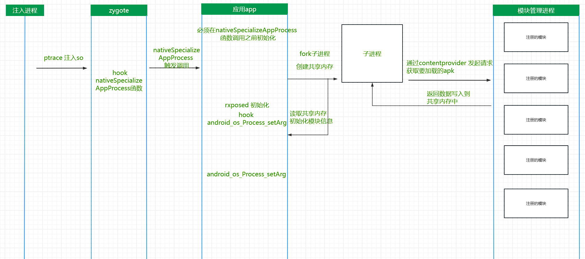

## android安全---从零打造一款全局注入工具rxposed（android 11一下，11以上有包可见性的问题）

##  [android 11以上包可见性问题的更新](/document/android11_appsfilter.md)

## 为什么要写这个工具

通过ptrace进行注入和hook，这个想法我估计很多人都会有，但是目前除了frida。
把一些技术梳理一下，然后合并起来做成一个成品，这是一件比较有成就的事情。
同时将各个部分所需要的技术都深入的研究一下，做成一个无感知的工具，来对抗不厌其烦的特征检测。

### 为什么不用frida：
frida无疑大大的降低了逆向的门槛和难度，但是，正因为如此也导致了frida特征众多，对于真正想要检测他的技术，几乎无法绕过。

## 参考的开源项目
lsposed
map self hide
fake-linker
frida
dobby

## 正文

### 应用架构简析

#### 应用架构图

#### ptrace方式注入so库到zygote进程中
android 发展至今，好像三款工具做到了xposed、magisk、frida。别的可能太小众，可能我忘记了。
magisk 和xposed 可以说都是通过系统文件替换的方式 ，xposed输入替换了java方法执行的so库，magisk属于从系统启动开始接管了系统的权限
frida 是通过root权限ptrace zygote进程，进行注入。
而我们想要做的是小巧，简单，可定制修改，减少依赖、特征，所以采用了ptrace的方式注入到zygote中，hook nativeSpecializeAppProcess。

#### nativeSpecializeAppProcess
开始是采用的fork函数，但是后来有一些问题，为了能精准的定位到新孵化的进程属于那个app，然后进行模块初始化，我从lsposed中找到了这个函数。
首先hook这个函数，然后通过参数判断是那个应用，fork一个子进程，子进程以zygote用户的权限的发起一个provider请求（android13有包可见性问题，普通应用可能没有这个权限），然后将数据存储到共享内存，返回给父进程。如果这个进程需要注入，就hook android_os_Process_setArg。

后续更

