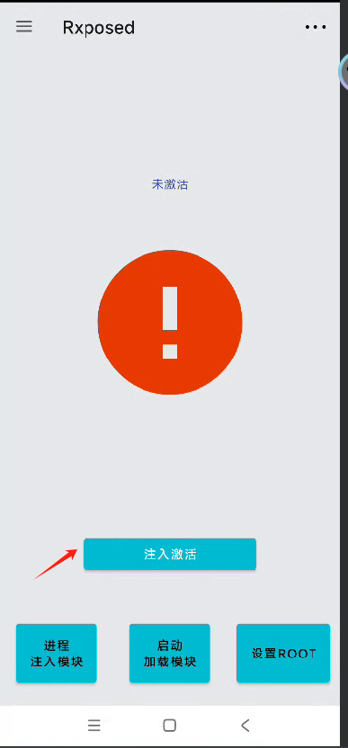
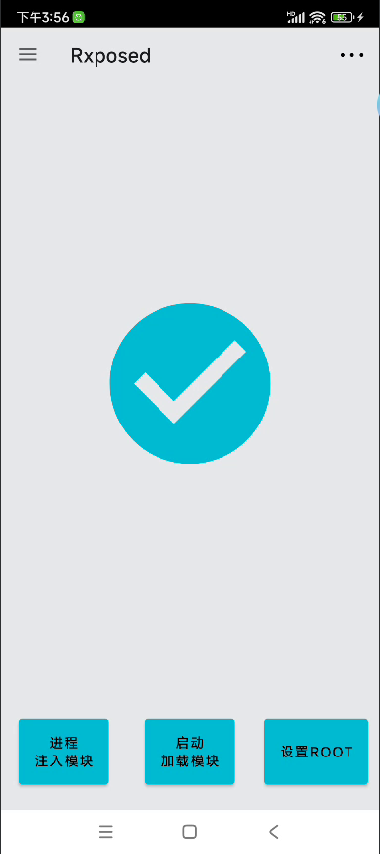
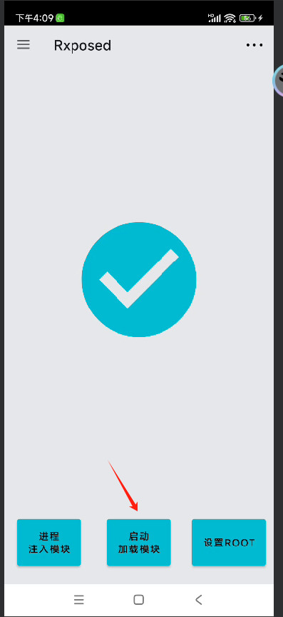
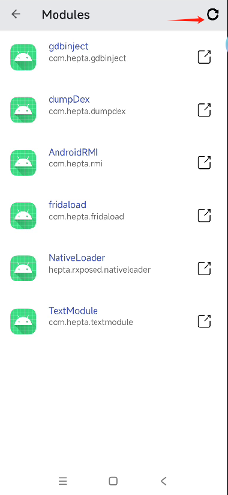
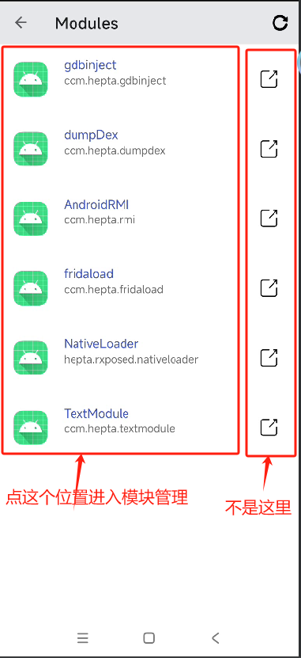
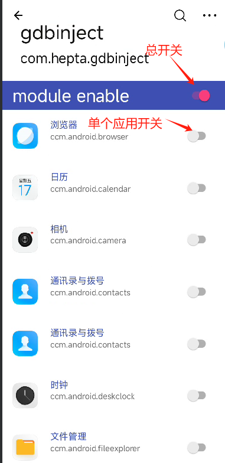

## 开启rxposed注入功能
如果图片看不清，请下载到本地，或者使用代理



需要root权限
成功的状态




## 模块编写
### 模块配置文件

创建一个应用，然后在配置文件中添加
```
<?xml version="1.0" encoding="utf-8"?>
<manifest xmlns:android="http://schemas.android.com/apk/res/android">


    <application
        android:allowBackup="true"
        android:icon="@mipmap/ic_launcher"
        android:label="@string/app_name"
        android:roundIcon="@mipmap/ic_launcher_round"
        android:supportsRtl="true"
        android:theme="@style/Theme.Rxmodule">
        <activity
            android:name=".MainActivity"
            android:exported="true">
            <intent-filter>
                <action android:name="android.intent.action.MAIN" />

                <category android:name="android.intent.category.LAUNCHER" />
            </intent-filter>
        </activity>


        <meta-data
            android:name="rxmodule"        
            android:value="true" />
        <meta-data
            android:name="rxposed_clsentry"
            android:value="com.hepta.textmodule.LoadEntry" />

        <meta-data
            android:name="rxposed_mtdentry"
            android:value="Entry" />

        <meta-data
            android:name="rxposed_hide"
            android:value="true" />


    </application>

</manifest>

```
rxmodule 会识别会一个模块，加载到模块列表  value没用
rxposed_clsentry 模块加载后第一个执行的类
rxposed_mtdentry 模块加载后第一个执行的类的方法
rxposed_hide    是否隐藏加载，如果不隐藏，会用PathClassLoader 直接加载apk

### 入口类
创建一个类
```
package com.hepta.textmodule;

import android.content.Context;
import android.util.Log;


public class LoadEntry {


    private static void PreLoadNativeSO(Context context, String source) {
        try {
            String abi= "arm64-v8a";
            if(!android.os.Process.is64Bit()){
                abi = "armeabi-v7a";
            }
            String str = source+"!/lib/"+abi+"/libpine.so";
            System.load(str);
        }catch (Exception e){
            Log.e("LoadEntry","LoadSo error");
        }

    }
			// context，应用的context
			// source 模块apk的绝对地址
			// 配置文件中可以传入的参数，后面有可能可以在管理器中动态配置
		
    public static void Entry(Context context , String source,String argument){   //入口类
        PreLoadNativeSO(context,source);
        hookAppText(context); //你需要写的代码
    }


}
```

将这个apk安装到手机中

## 安装以后的配置


点击 启动加载模块



才安装的apk应该是没有在模块列表的，而且我没有写apk安装监听功能，需要手动刷新一次，当显示了模块以后，点进去



打开总开关，才可以启用这个模块，然后打开其中某个应用的开关



你需要注入的应用，在启动以后会自动加载这个模块，并且是在应用代码执行之前。


## so功能使用须知
rxposed_hide    是否隐藏加载，如果不隐藏，会用PathClassLoader 直接加载apk，如果隐藏，会使用InMemoryDexClassLoader加载dex，然后使用自定义linker加载so。
+ PathClassLoader 加载
  需要自己手工加载so
  ```
      private static void PreLoadNativeSO(Context context, String source) {
      try {
          String abi= "arm64-v8a";
          if(!android.os.Process.is64Bit()){
              abi = "armeabi-v7a";
          }
          String str = source+"!/lib/"+abi+"/libpine.so";
          System.load(str);
      }catch (Exception e){
          Log.e("LoadEntry","LoadSo error");
      }

  }
  ```

+ 自定义linker
    + 不支持静态注册的native函数，只支持动态注册。
    + apk中的所有so会自动加载，但是不支持so相互依赖功能
      举个简单的例子，我们在native层使用android log，需要配置一个log库
      ```
      cmake_minimum_required(VERSION 3.18.1)
      # The version number.
      set (Tutorial_VERSION_MAJOR 1)
      set (Tutorial_VERSION_MINOR 0)


      # configure a header file to pass some of the CMake settings
      # to the source code

      # add the binary tree to the search path for include files
      # so that we will find TutorialConfig.h

      # add the executable


      include_directories(${CMAKE_SOURCE_DIR}/include)

      add_library( # Sets the name of the library.
              native
              # Sets the library as a shared library.
              SHARED
              # Provides a relative path to your source file(s).
              checkvpn.cpp)

      # in android studio build.gradle


      find_library( # Sets the name of the path variable.
              log-lib
              # Specifies the name of the NDK library that
              # you want CMake to locate.
              log )

      target_link_libraries( # Specifies the target library.
              native
              ${log-lib})

      ```

      这样打包以后，打包的出来的apk,除了我们使用的so，还有一个liblog.so,我们的so,是依赖于liblog.so的

      这种情况下，自定义linker是无法使用的，so不能有依赖关系，但是可以加载多个，依赖关系我没有进行处理

      使用日志的解决方案
      ```
      cmake_minimum_required(VERSION 3.18.1)
      # The version number.
      set (Tutorial_VERSION_MAJOR 1)
      set (Tutorial_VERSION_MINOR 0)


      set(CMAKE_CXX_FLAGS "${CMAKE_CXX_FLAGS} -fPIE")
      set(CMAKE_C_FLAGS "${CMAKE_C_FLAGS} -fPIE")
      # configure a header file to pass some of the CMake settings
      # to the source code

      # add the binary tree to the search path for include files
      # so that we will find TutorialConfig.h

      # add the executable


      include_directories(${CMAKE_SOURCE_DIR}/include)

      add_library( # Sets the name of the library.
              native
              # Sets the library as a shared library.
              SHARED
              # Provides a relative path to your source file(s).
              checkvpn.cpp)

      # in android studio build.gradle


      target_link_libraries( # Specifies the target library.
              native
              log)

      ```
      这样打出来的包，就没有liblog.so了

## 编写思路
没有任何sdk库，和提供的api，只提供应用注入和对抗功能，所有的代码编写，都可以按照android开发程序的思路编写
